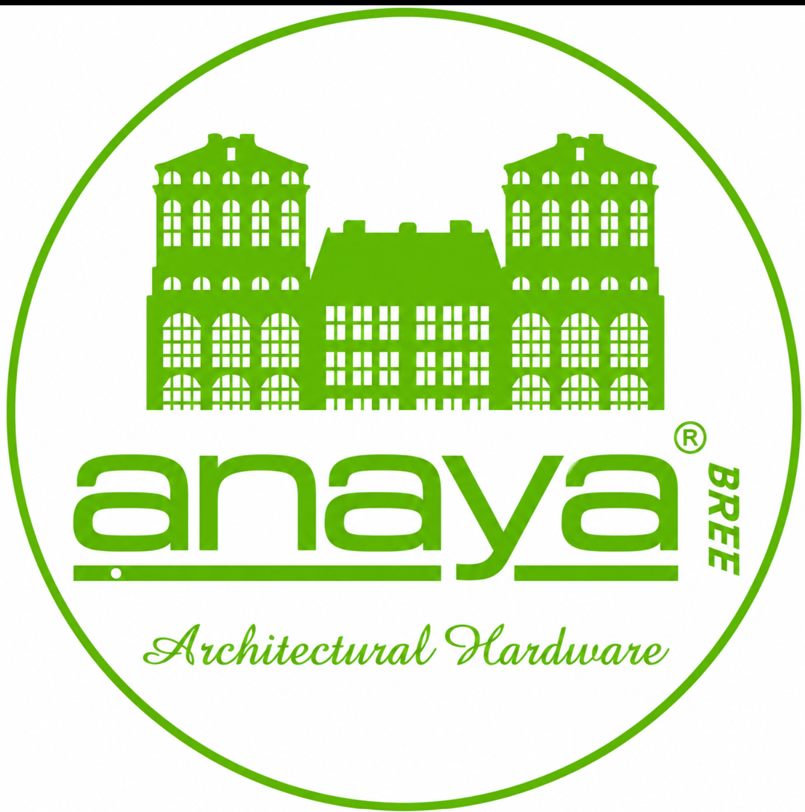
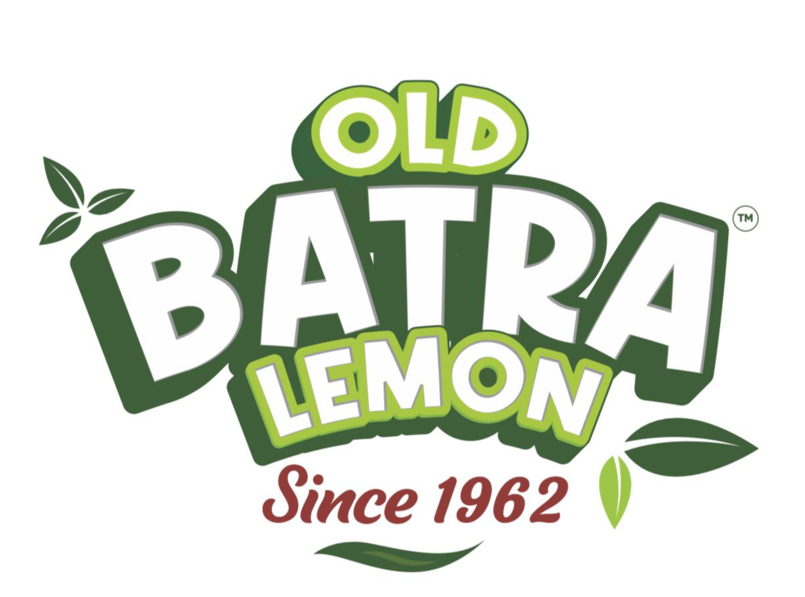
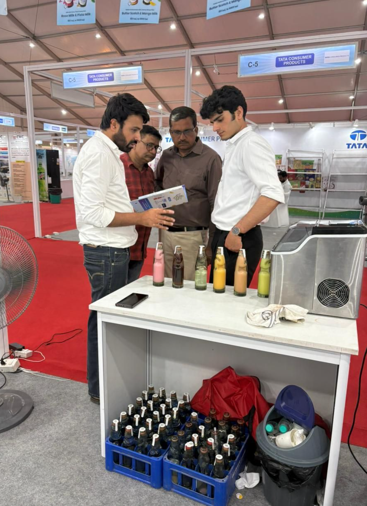
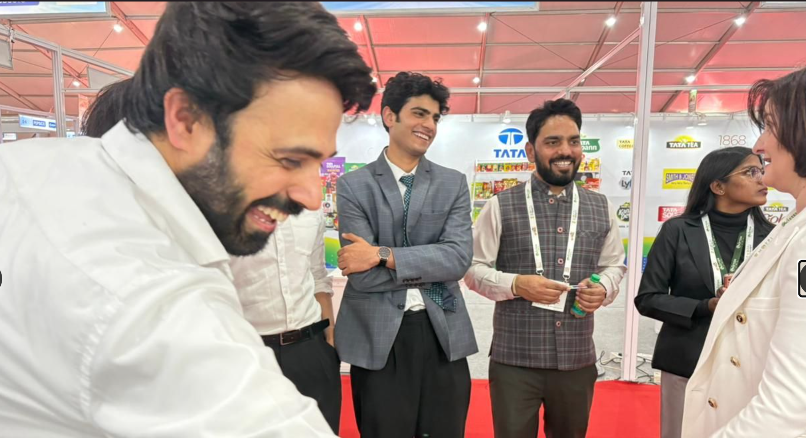
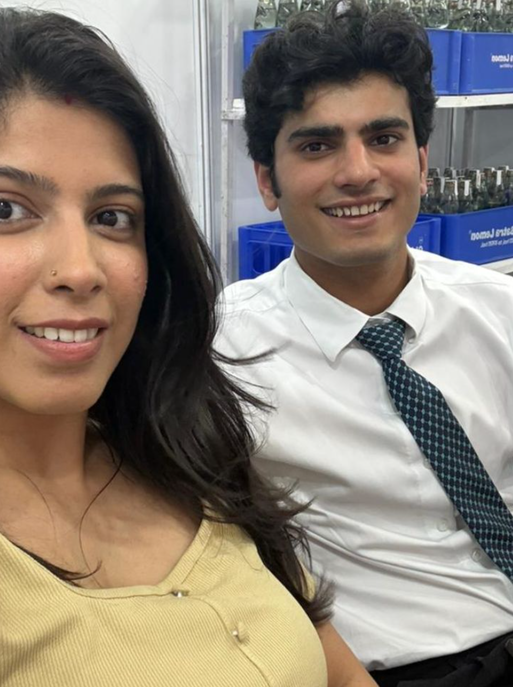
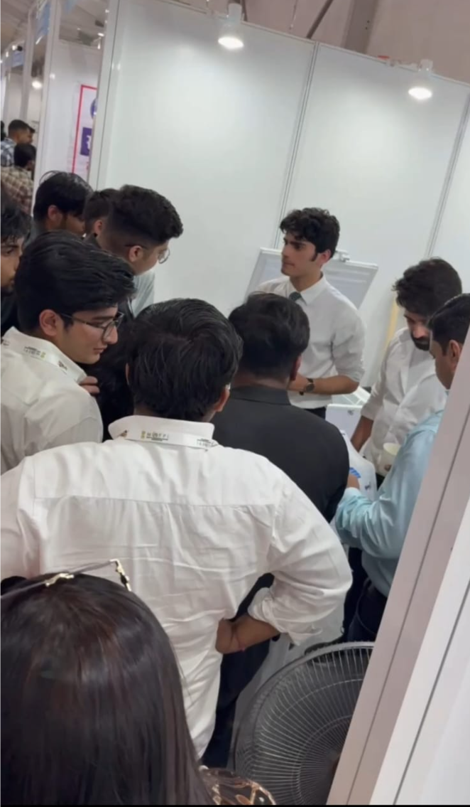
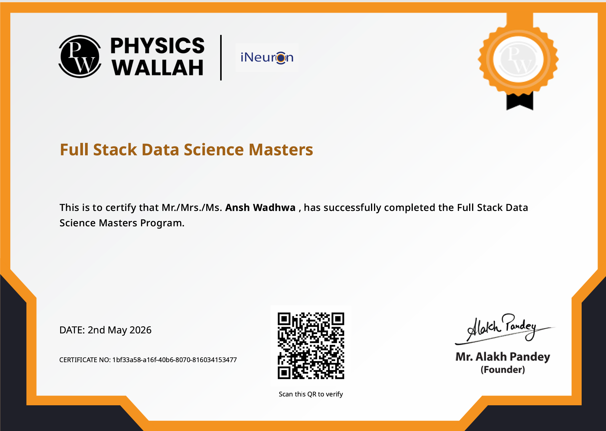
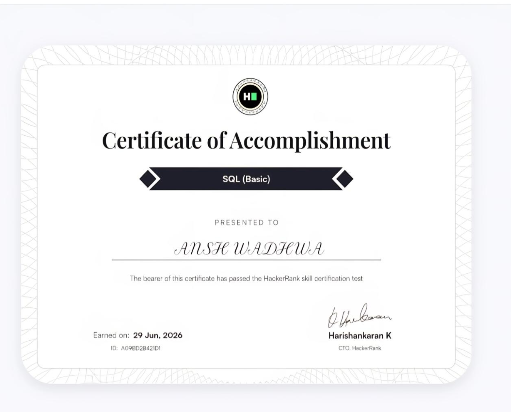
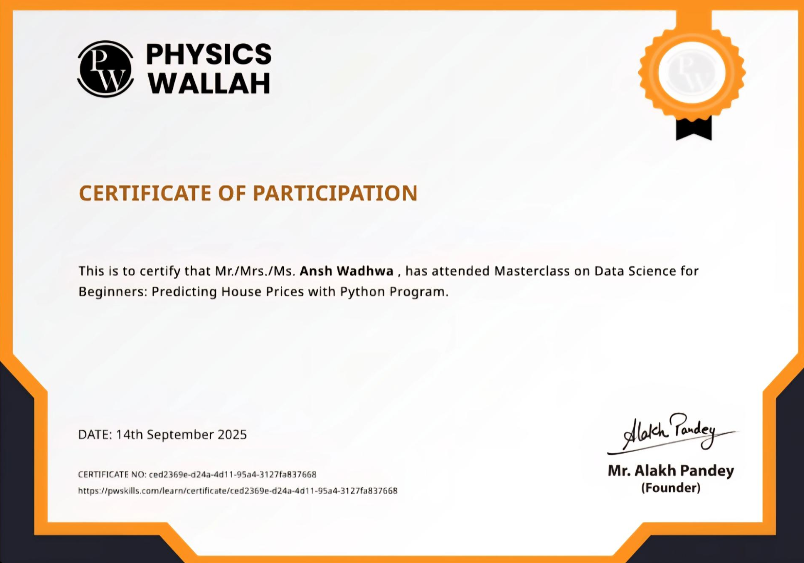

# 

# **ANSH PORTFOLIO**

### **AI • DATA SCIENCE • MACHINE LEARNING • BUSINESS ANALYTICS**

Building intelligent systems, transforming raw data into business value, and creating scalable AI solutions for real-world impact.

---

# About

Welcome to my portfolio repository.

This project represents my journey as an **AI & Data Science Engineer**, where I build intelligent applications powered by machine learning, analytics, automation, and cloud technologies.

The portfolio showcases my technical expertise, real-world projects, certifications, internships, research work, and achievements in one place with a modern responsive interface.

---

# Highlights

-  Machine Learning Projects
-  Business Intelligence & Analytics
-  Cloud Ready Applications
-  Python Development
-  Flask Web Applications
-  SQL & Database Engineering
-  Interactive Dashboards
-  Deployment Ready Projects
-  Research & Case Studies
-  Professional Portfolio

---

#  Portfolio Preview

---

#  Journey

&nbsp;&nbsp;&nbsp;&nbsp;

 

&nbsp;&nbsp;&nbsp;&nbsp;

 

&nbsp;&nbsp;&nbsp;&nbsp;

 

&nbsp;&nbsp;&nbsp;&nbsp;

 

---

# 💼 Tech Stack

| Category | Technologies |
|----------|--------------|
| Programming | Python, SQL |
| Data Science | Pandas, NumPy, Scikit-Learn |
| Visualization | Power BI, Matplotlib, Plotly |
| Backend | Flask |
| Database | MySQL |
| Version Control | Git, GitHub |
| Cloud | AWS |
| Deployment | Docker |

---

#  Featured Projects

###  AI Projects

- Customer Churn Prediction
- House Price Prediction
- Retail Customer Analytics
- Consumer Preference Intelligence
- Diamond Price Prediction

---

###  Analytics

- Business Intelligence Dashboards
- Customer Segmentation
- Sales Analytics
- Market Research
- Data Visualization

---

#  Certifications

- Python Programming
- SQL
- Machine Learning
- Data Analytics
- Business Intelligence

---

#  Repository Statistics

  

  

---

#  Repository

If you found this portfolio inspiring or useful, consider giving it a **Star ⭐**.

It motivates me to continue building impactful AI and Data Science projects.

---

#  Author

# **ANSH**

### AI & Data Science Engineer

*"Turning complex data into intelligent solutions."*

 

  

**Made with ❤️ using Python, Flask, HTML, CSS & JavaScript**

